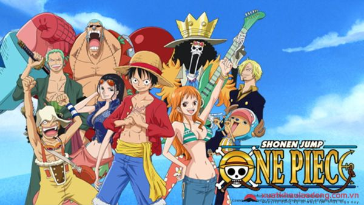
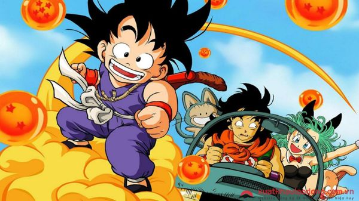
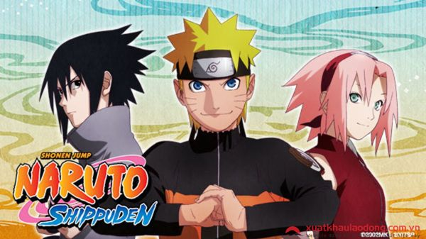
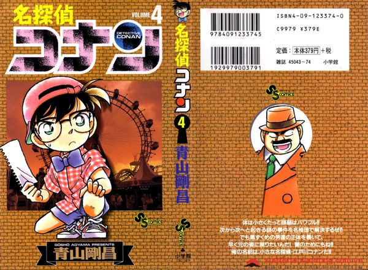
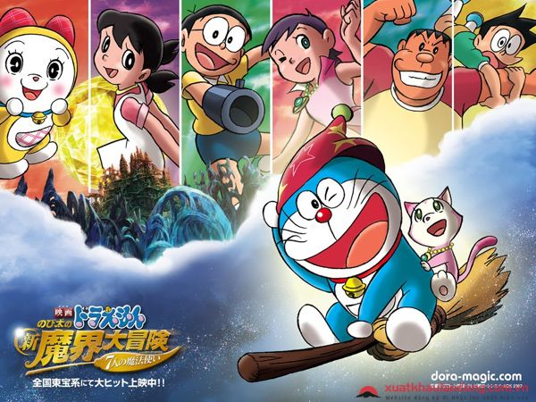
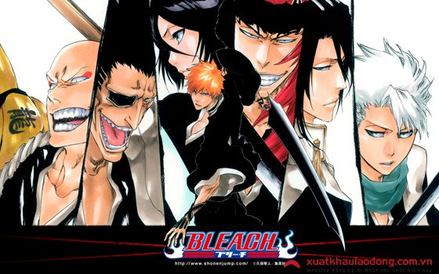

<!DOCTYPE html>
<html>
<head>
<title>Top truyen tranh hay nhat</title>
</head>
<body>

  <h1 style="color:red;">Top những truyện tranh hay nhất Nhật Bản trong quá khứ bạn trẻ </h1>
  <table>
  <tr>
  <td>One Piece</td>
  </tr>
  <tr>
  <td>Dragon Ball</td>
  </tr>
  <tr>
  <td>Naruto</td>
  </tr>
  <tr> 
  <td>Conan</td>
  </tr>
  <tr>  
  <td>Doramon</td>
  </tr>
  <tr>
    <td>Bleach</td>
  </tr>
</table>
  <h2>1. One Piece</h2> 

Nói về Manga Nhật Bản thì ta không thể không nhắc đến One Piece - Đảo Hải Tặc. Đây là bộ truyện ra đời sớm nhất và có sức hút nhất đối với giới trẻ hiện nay. 

One Piece là bộ truyện xoay quanh một nhóm cướp biển được gọi là băng Hải tặc Mũ rơm, được thành lập và lãnh đạo bởi Monkey D. Luffy. Luffy là một cậu bé có ước mơ tìm thấy kho báu vĩ đại nhất - One Piece - kho báu của vua hải tặc đời trước và trở thành vua hải tặc đời tiếp theo.
 

  
  
One Piece trở thành bộ truyện manga Nhật Bản có có doanh số cao nhất có lẽ bởi một phần là về chủ đề của truyện - Hải tặc. Đây là một chủ đề độc đáo và ít xuất hiện trong manga Nhật.

  
Điều thứ hai có lẽ là "Mũ rơm" và trang phục của thuyền trưởng Luffy, các độc giả hài hước đã nhận xét rằng Luffy trông giống một tên hai lúa nhà quê hơn là một tên cướp biển chân chính và bạn thử nghĩ xem có băng cướp nào lại đặt tên là "Hải tặc Mũ rơm" không?

  
Một điểm thu hút của truyện nữa đó là tình bạn, tình đồng đội cũng như những ước mơ, hoài bão của con người đã được tác giả Oda Eiichiro truyền tải một cách hóm hỉnh mà sâu sắc

  
nếu muốn xem One Piece có thế xem link ở phần dưới đây : 
  <a href="https://https://animehay.club/tim-kiem/one-piece.html/">Visit animehay.club</a>
 
  <h2>2.Dragon Ball</h2>
  
Dragon Ball chắc hẳn là truyện tranh Nhật Bản gắn liền với hầu hết tuổi thơ của chúng ta. Tôi còn nhớ thời đi học cấp 1 và cấp 2, mỗi đứa đều phải thuê cho mình ít nhất 1 cuốn để đọc rồi lại mượn thằng ngồi bên cạnh và cùng trao nhau đọc. Vậy truyện Dragon Ball - Bảy viên ngọc rồng có gì mà thu hút đến vậy?

   
  
Dragon Ball xoay quanh cuộc hành trình của cậu bé Son Goku, từ lúc bé cho đến khi trưởng thành. Những lần tầm sư học đạo, khám quá thế giới và truy tìm các viên ngọc rồng để thực hiện điều ước rồng thiêng. Xuyên suốt cuộc hành trình, cậu đã gặp được nhiều bạn bè và chống lại những kẻ hung ác có ý định dùng điều ước rồng thiêng để thống trị thế giới.

Tại Việt Nam, nhà xuất bản Kim Đồng đã xuất bản với tên nguyên gốc và có tên phụ là Bảy viên ngọc rồng.

   
nếu muốn xem Dragon Ball link phần dưới đây : 
   <a href="https://animehay.club/tim-kiem/dragon-ball.html/">Visit animehay.club</a>
  <h2>3.Naruto</h2>
  
Với những Fan của Manga Nhật bản thì Naruto là bộ truyện không thể không nhắc đến. Bộ truyện kể về cậu bé Naruto, 12 năm trước, làng Lá bị một con Cửu vĩ hồ tấn công. Hokage đệ tứ - người đứng đầu làng Lá - đã phong ấn một con hồ ly vào người Naruto.

  
12 năm sau, cậu bé lớn lên trong sự khiếp sợ và lo lắng của người dân làng. Họ sợ một ngày nào đó, phong ấn Cửu vĩ hồ trên người Naruto bị hủy, cậu bé sẽ trở thành sự hủy diệt cho ngôi làng. Cậu nhóc bị xa lánh và tuổi thơ cậu tràn đầy bóng tối u ám.

     
  
Khi đến tuổi, cậu bé vào học tại Học viện đào tạo Ninja như bạn bè cùng trang lứa. Tại đây, cậu đã gặp được những người bạn, người thầy giúp cậu thay đổi chính mình.
  
Cậu bé hiếu động, ồn ào và sống một cách mạnh mẽ. Cậu đã tự chính bản thân chứng minh cho dân làng thấy cậu là Uzumaki Naruto chứ không phải đứa trẻ bị nguyền rủa, không phải là cái bóng của con quái vật độc ác. Ước mơ lớn nhất của Naruto đó chính là trở thành một Hokage, và để thực hiện được ước mơ ấy, cậu phải càng mạnh mẽ thêm nữa.

  
Naruto là một bộ truyện dạy bạn phải biết yêu thương. Yêu thương và tha thứ sẽ tiếp thêm sức mạnh cho bạn, thù hận và lòng tham sẽ chỉ là sợi dây trói buộc mà bạn không thể nhận ra cho đến khi quá trễ. Hãy mạnh dạn và tin tưởng vào con đường của mình dù bạn không biết điểm cuối nó sẽ như thế nào, vì đó là con đường mà bạn đã chọn.

    
nếu muốn xem Naruto link phần dưới đây:
   <a href="https://animehay.club/tim-kiem/naruto.html/">Visit animehay.club</a>
  <h2>4.Conan</h2>
  
Ai trong chúng ta chắc ít nhất một lần đọc Conan và cùng hòa vào những vụ án cùng những tình tiết nổi bật trong truyện. Thám tử lừng danh Conan kể về thám tử trung học Kudo Shinichi. Trong một lần điều tra, cậu bị hai thành viên trong tổ chức áo đen phát hiện. Chúng cho cậu uống loại thuốc teo nhỏ APTX 4869 do tổ chức điều chế ra và biến cơ thể cậu trở về hình dạng của một đứa trẻ học tiểu học.

  
Sau đó, cậu đổi tên thành Edogawa Conan và sống tại nhà thám tử gà mờ Mori Kogoro. Xuyên suốt những tập truyện là quá trình cậu âm thầm hỗ trợ điều tra các vụ án bên cạnh ông Mori và tìm ra được kẻ sát nhân cuối cùng. 

  
  
Tác giả Aoyama đã lên kế hoạch tạo ra kết thúc cho Conan từ năm 2007, nhưng cho đến hiện tại tập cuối của bộ truyện này vẫn chưa được ra mắt.

   
nếu muốn xem Naruto link phần dưới đây:
   <a href="https://animehay.club/tim-kiem/conan.html/">Visit animehay.club</a>
  <h2>5.Doraemon</h2>
    
Doraemon là một trong những top truyện tranh hay tại Nhật đưa đa số các bạn trẻ ưa thích, truyện manga kể về một chú mèo máy không tai đến từ thế kỷ 22 - Doraemon để giúp một cậu bé hậu đậu lớp 5/3 tên là Nobi Nobita.

    
Doraemon có một chiếc túi thần kỳ trước bụng với vô vàn loại bảo bối của tương lai, chú mèo máy thường sẽ lấy những bảo bối thần kỳ để giúp Nobita thoát khỏi những rắc rối của cậu bé, để trả đũa hoặc khoe khoang với các bạn bè của cậu.

    
Thường thì với những bảo bối thần kỳ, Nobita thường đi quá xa so với dự định ban đầu của Doraemon và khiến mọi chuyện trở nên rắc rối hơn. Ở cuối mỗi câu chuyện, những ai gây rắc rối hoặc sử dụng sai mục đích của bảo bối sẽ phải chịu hậu quả do mình gây ra và người đọc sẽ rút ra được những bài học từ đó.

    
      
Doraemon được phát hành tại Nhật Bản và nhiều quốc gia trên thế giới, trở thành một trong những bộ truyện tranh được hâm mộ nhiều nhất, đặc biệt là ở Châu Á. 

       
nếu muốn xem Doramon link phần dưới đây:
   <a href="https://animehay.club/thong-tin-phim/doraemon-new-tv-series-292.html/">Visit animeha.club</a>
 <h2>6.Bleach</h2>
  

Bleach kể về những cuộc phiêu lưu của Kurosaki Ichigo sau khi anh có được những quyền hạn của Soul Reaper - một sự nhân cách hóa cái chết tương tự như Grim Reaper - từ một Soul Reaper khác, Kuchiki Rukia. Sức mạnh mới phát hiện này buộc anh phải nhận nhiệm vụ bảo vệ con người khỏi ma quỷ và hướng dẫn linh hồn sang thế giới bên kia.

      
    

Bleach đã được đánh giá là bộ phim truyền hình anime phổ biến thứ tư tại Nhật Bản trong năm 2006 và nằm trong top mười anime hàng đầu tại Hoa Kỳ từ 2006-2008. Bleach cũng nhận được giải thưởng Shogakukan Manga Award trong năm 2005, và là một trong những manga bán chạy tốt nhất tại cả Nhật Bản và Hoa Kỳ. Ở Việt Nam, Bleach được phát hành với tên gọi Sứ mạng thần chết từ năm 2010.

  
nếu muốn xem Bleach link phần dưới đây:
   <a href="https://animehay.club/tim-kiem/Bleach.html/">Visit animeha.club</a>

</body>
</html>
